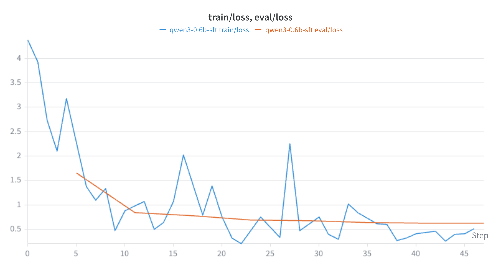

# Large Behavior Model on Twin-2K-500
Designing a Large Behavior Model for the following problem statement


**Given a person's answers from waves 1–3 (their "persona"), predict how that same person answers the held-out wave-4 questions — and evaluate against both the real wave-4 answers and the human test–retest ceiling**


# Section 1 Data Exploration 

Dataset Link - https://huggingface.co/datasets/LLM-Digital-Twin/Twin-2K-500

#### Dataset Usage
1. Full Persona Dataset - This dataset contains all waves data reported together. It can be skipped as the persona information columns contains wave 4 responses for common set of questions of wave 1-3 and wave 4. This would lead to target leakage if used for training.
2. **Wave Split Dataset** - After analyzing the dataset and also as reported by the authors, this is the dataset I used for building and evaluating models.
3. Question Catalog (question_catalog.json) - This datasets contains all the Question asked in either wave 1-3 or wave 4 to the participant. I used this dataset for evaluation metrics purposes to create answer ranges from the answer options for each question based on their `QuestionID` field. Specifically for Matrix and MC Type Questions available via `QuestionType` field, I used `Col` and `Options` fields respectively to get the available set of answers for each question.
  
### Dataset Statistics - Wave Split Dataset

### Analysis of Q&A of Wave 1 to Wave 3

I analayzed the Wave 1 to Wave 3 Q&A from the `wave1_3_persona_json` by expanding the json format column from the `wave_splits `dataset which is at persona or user level to each Q&A answer by each user. 
The statistics are as follows  - 

- Total Questions Answered :  353929 
- Unique Number of Persons : 2058
- Total number of Duplicates Q&A rows Found - 0
- Total Uniques Questions Asked - 171. The following table shows a breakdown of Question by different block names - 

| Block Name                      | Unique Question Counts | Question Types          | 
|---------------------------------|-----------------------:|-------------------------|
| Cognitive tests                 | 69                     | DB, MC, TE              |
| Personality                     | 49                     | DB, MC, Matrix, TE      |
| Economic preferences            | 36                     | DB, MC, Matrix, TE      |
| Demographics                    | 14                     | MC                      |
| Economic preferences - intro    | 2                      | DB                      |
| Forward Flow                    | 1                      | TE                      |
| Total | 171 | | 

Where DB = Descriptive Bloc, MC = Multiple Choice, TE = Text Entry and Matrix = Likert scale

- The dataset is heavily skewed towards cognitive test and lesser towards the economic preferences. Keeping the representations of each question is quite important if we were to sample questions to fit the context size of an LLM model as any question can be asked at test time. 

- The following table shows the dataset contribution by different Question Types 

| Question Type | Number of Rows | Percentage (%) |
|---------------|---------------:|---------------:|
| MC | 220,199 | 62.22 |
| Matrix | 59,682 | 16.86 |
| TE | 45,236 | 12.78 |
| DB | 28,812 | 8.14 |

- The dataset is heavily skewed towards Multiple Choice Quesstion and lesser towards the Matrix type question. Keeping the representations of each question type is quite important if we were to sample questions to fit the context size of an LLM model as any question can be asked at test time. 

### Analysis of Q&A of Wave 4 

For wave 4 Q&A extraction, I used the `wave4_Q_wave4_A` field of the wave_split dataset and unroll it to prepare data at Q&A-PID level
- Total Number of Rows which represent number of Q&A answered in total - 131712
- Total Uniques Questions Asked - 85. The following table shows a breakdown of Question by different block names - 

| Block Name | Unique Question Count | Question Types |
|------------|----------------------:|----------------|
| Product Preferences - Pricing | 41 | DB, MC |
| Non-experimental heuristics and biases | 5 | MC, Matrix, Slider |
| Anchoring - African countries high | 2 | MC, TE |
| Anchoring - African countries low | 2 | MC, TE |
| Anchoring - redwood high | 2 | MC, TE |
| Anchoring - redwood low | 2 | MC, TE |
| Proportion dominance 1C | 1 | MC |
| Outcome bias - success | 1 | MC |
| Probability matching vs. maximizing - Problem 1 | 1 | Matrix |
| Probability matching vs. maximizing - Problem 2 | 1 | Matrix |
| Proportion dominance 1A | 1 | MC |
| Proportion dominance 1B | 1 | MC |
| Absolute vs. relative - calculator | 1 | MC |
| Proportion dominance 2A | 1 | MC |
| Proportion dominance 2B | 1 | MC |
| Outcome bias - failure | 1 | MC |
| Sunk cost - no | 1 | TE |
| Sunk cost - yes | 1 | TE |
| WTA/WTP Thaler - WTP noncertainty | 1 | MC |
| WTA/WTP Thaler problem - WTA certainty | 1 | MC |
| Proportion dominance 2C | 1 | MC |
| Myside Ford | 1 | MC |
| Myside German | 1 | MC |
| Absolute vs. relative - jacket | 1 | MC |
| Linda-conjunction | 1 | Matrix |
| Linda - no conjunction | 1 | Matrix |
| Less is More Gamble C | 1 | MC |
| Less is More Gamble B | 1 | MC |
| Less is More Gamble A | 1 | MC |
| False consensus | 1 | Matrix |
| Disease-loss | 1 | MC |
| Disease - gain | 1 | MC |
| Base-rate 70 engineers | 1 | Slider |
| Base-rate 30 engineers | 1 | Slider |
| Allais Form 2 | 1 | MC |
| Allais Form 1 | 1 | MC |
| WTA/WTP Thaler problem - WTP certainty | 1 | MC |


#### Other Findings
- DB questions are descriptive blocks for the next question and should not be considered for evaluation.
I removed 2058 rows from the test-retest accuracy evaluation set. But these block could be useful for training data as they provide LLMs with the context for a question
- Users can also skip the question 
    - We can anayze user Settings -> ForceResponse 
    - And remove the skipped question (Didn't completed)


### Test-Retest Evaluation of reliability of humans

#### Step 1. Filtering data for evaluation 
I filtered the wave 4 dataset which contains 131,712 Q&A pairs rows.
- Filter 1 After Dropping DB descriptive block question's 2058 rows, remaining rows were - 129654
- Filter 2 I also dropped questions where both Wave 1 to Wave3 and Wave 4 answer are None.
There were around 10,290 rows found which belonged to the TE (6,174) rows and Slider Question types (4,116) rows

After apply filter 1 and filter 2, we are left with 119,364 Q&A rows answered by 500 participants in Wave 4 for human test-retest evaluation dataset.

The statistics of the dataset by quesion type is as following
|  Question Type   | Number of Questions 
|-----|-----| 
|Multiple Choice (MC) | 109,074 | 
|Matrix | 10,290
|Total | 119,364

#### Step 2. Evaluation Methodology and Results

As Evaluation will differ by Question Types because they have different answer ranges, we must compute metrics for them individually. As reported in the paper the answer are of 2 types binary or numerical. 

Author Evaluation Metric Definition 
 ```
 For non-binary measures, we calculate the absolute deviation between the ground truth and predicted answer, divided by the range of possible answers. We then compute accuracy as 1 minus this absolute deviation. This measure generalizes accuracy from binary to numerical questions: it ranges between 0 and 1, is equal to 1 when the prediction is equal to the ground truth, and 0 when it is maximally different. When multiple questions are included in the same task, we take the mean accuracy across the questions within each task
 ```

As we have 2 types Multiple Choice (MC) and Matrix Type, I handled them in following ways


#### **MC(Multiple Choice) Question type**  

- It can be binary or range of answers. 
    - For binary questions, I consider the answer as correct and score of 1 if the Wave4 answer exact match of Wave1-3 Answer else its a score of 0.
    - For MC Question 

- Evaluation Results for Multiple Choice Questions
    | Question Type | Metric | Test-Retest Accuracy  | Number of Rows | Number of Unique Qs
    |------ | ----- | ------ | ----- |----- | 
    |Multiple Choice (MC) - Binary |  Exact Match | **83.27%** | 92,610 | 77
    |Multiple Choice (MC) - Ordinary |  Mean Absolute Deviation | **83.80%** | 16,464 | 98 

- BlockWise Evaluation Metrics (Multiple Choice (MC) - Ordinary)

    | Block Name | Mean Normalized Accuracy | Unique Questions | Total Responses | % of Total Responses |
    |------------|-------------------------:|-----------------:|----------------:|---------------------:|
    | WTA/WTP Thaler - WTP noncertainty | 93.05% | 1 | 673 | 4.09% |
    | WTA/WTP Thaler problem - WTP certainty | 89.98% | 1 | 712 | 4.32% |
    | Outcome bias - success | 88.58% | 1 | 1,052 | 6.39% |
    | Proportion dominance 1C | 87.83% | 1 | 651 | 3.95% |
    | Proportion dominance 1B | 86.72% | 1 | 672 | 4.08% |
    | Proportion dominance 2B | 85.80% | 1 | 672 | 4.08% |
    | Proportion dominance 2C | 85.68% | 1 | 651 | 3.95% |
    | Proportion dominance 1A | 85.54% | 1 | 735 | 4.46% |
    | Proportion dominance 2A | 85.31% | 1 | 735 | 4.46% |
    | Myside German | 84.77% | 1 | 1,043 | 6.34% |
    | WTA/WTP Thaler problem - WTA certainty | 84.50% | 1 | 673 | 4.09% |
    | Myside Ford | 84.35% | 1 | 1,015 | 6.16% |
    | Outcome bias - failure | 84.01% | 1 | 1,006 | 6.11% |
    | Non-experimental heuristics and biases | 80.58% | 1 | 2,058 | 12.50% |
    | Disease - gain | 80.54% | 1 | 1,003 | 6.09% |
    | Less is More Gamble A | 80.20% | 1 | 735 | 4.46% |
    | Disease-loss | 80.02% | 1 | 1,055 | 6.41% |
    | Less is More Gamble C | 75.73% | 1 | 651 | 3.95% |
    | Less is More Gamble B | 75.37% | 1 | 672 | 4.08% |


-  BlockWise Evaluation Metrics (Multiple Choice (MC) - Ordinary)
    
    | Block Name | Mean Normalized Accuracy | Unique Questions | Total Responses | % of Total Responses |
    |------------|-------------------------:|-----------------:|----------------:|---------------------:|
    | Anchoring - redwood low | 93.80% | 1 | 1,049 | 1.13% |
    | Product Preferences - Pricing | 83.89% | 40 | 82,320 | 88.89% |
    | Absolute vs. relative - calculator | 80.89% | 1 | 1,031 | 1.11% |
    | Anchoring - African countries high | 80.78% | 1 | 1,056 | 1.14% |
    | Anchoring - African countries low | 79.44% | 1 | 1,002 | 1.08% |
    | Anchoring - redwood high | 77.70% | 1 | 1,009 | 1.09% |
    | Absolute vs. relative - jacket | 77.41% | 1 | 1,027 | 1.11% |
    | Allais Form 1 | 77.07% | 1 | 1,051 | 1.13% |
    | Non-experimental heuristics and biases | 72.16% | 1 | 2,058 | 2.22% |
    | Allais Form 2 | 70.90% | 1 | 1,007 | 1.09% |


#### **Matrix Question type**  

- It has 36 unique questions. Out of them, 23 questions are likert scale and 13 bipolar.
As bipolar is also a range of answers as mentioned in the definiton, I considered them same as likert scale.
For these questions, I subset their QuestionId from the `question_catalog.json`. I then used their `Columns` column and convert them to likert numerical scales. Then I compute the Absolute deviation between the ground truth's number and predicted answers's and divide by range of possible answer,similar to being reported by authors as mentioned above.
    -  As there could be multiple Matrix Questions together in a list,for each
        - Compute score for item i ` 1 - abs( ground_truth_likert_scale_number - predicted_likert_scale_number)/ `
        - Take average of this score for all the items in the list diving by the number of Questions in the list

- Evaluation Results for Matrix Questions
    | Question Type | Metric | Test-Retest Accuracy | Number of Rows | Number of Unique Qs
    |------ | ----- | ------ | ------- | ----- |
    |Matrix | Mean Absolute Deviation | **83.45%** | 10290 | 36

- Blockwise Matrix Evaluation Metrics

    | Question Type | Block Name                                             | Mean Normalized Accuracy | Unique Questions | Total Responses | % of Total Responses |
    |------------|--------------------------------------------------------|-------------------------:|-----------------:|----------------:|---------------------:|
    | Matrix     | False consensus                                        | 87.44%                   | 1                | 2,058           | 20.00%               |
    | Matrix     | Non-experimental heuristics and biases                 | 86.32%                   | 2                | 4,116           | 40.00%               |
    | Matrix     | Linda -no conjunction                                  | 83.24%                   | 1                | 1,029           | 10.00%               |
    | Matrix     | Linda-conjunction                                      | 81.57%                   | 1                | 1,029           | 10.00%               |
    | Matrix     | Probability matching vs. maximizing - Problem 2        | 76.17%                   | 1                | 1,026           | 9.97%                |
    | Matrix     | Probability matching vs. maximizing - Problem 1        | 73.36%                   | 1                | 1,032           | 10.03%               |
    

#### Overall Test-Retest Accuracy Results

| Question Type | Metric | Test-Retest Accuracy  | Number of Rows | Number of Unique Qs
|------ | ----- | ------ | ----- |----- | 
|Multiple Choice (MC) - Binary |  Exact Match | **83.27%** | 92,610 | 77
|Multiple Choice (MC) - Ordinary |  Mean Absolute Deviation | **83.80%** | 16,464 | 98 
|Matrix | Mean Absolute Deviation | **83.45%** | 10290 | 36
|Overall | Overall | **83.36%** | 119,364 | 211

I calculate  overall test-retest accuracy as the wieghted accuracy by number of rows and report as 83.36% between Wave13 and Wave14 answers.

Note - I also didn't use this the same evaluation dataset to measure against the LLM as the model requires training test splits and it won't be correct to split by rows or by question types directly. I discuss in the next section the strategy use to create the train and test/evaluation dataset.


<!-- ### Token statistics
- To help decide which model to choose in terms of context length.
- Full Persona - For summary text of a persona profile, maximum of 3,061 words and average of 2,014 words, can be approximated as X tokens based on 1 token = 3/4 word 
- Wave Dataset - Answer are around similar length for wave1-3 and wave 4 and are around 6320 words. -->


###  Dataset Biases

1. **Population Bias**  - Only users from US are the subject of this study, a system trained on this dataset might not be able to generalize and perfom well to users outside the United States as it denotes their preferences and behavior which can vary greatly among geographies.
2. **Question Category (Block Name) Dataset Imbalance**
The dataset doesn't contain even number of question per category. Cognitive tests dominate and contains 40 percent of the Wave13 questions asked, whereas the Economic preferences contribute to 20 percent of the questions. Training models require careful balancing of the dataset through sampling or other techniques.

### Limitations
1. Unavailabilty of Real World Bheavior Dataset - Actual Dataset represent users answers in a survey setting, while their actual behavior like purchases, which can be different is missing. This actual data can be extremely valuable to predict their future behavior.

2. Small Sample Size - 500 people is a very small sample size to simulate the human behavior 
of the actual population which can be millions of people. (For Example, extrapolating to 1 Million people means that this dataset represent only 0.05 percent of the actual population) 

# Section 2 Modelling Strategy

### 2.1 Problem Formulation

Objective - ***To build an LLM based behavior model that predicts how a participant answer questions
in current setting, given their historical survey Q&A dataset.***

Formally, given a set of historical Q&A set of Users as user persona P, the model has to compute the conditional probability `P(A|P,Q)` and generate A, the Answer 
for current Question Q.


### 2.2 Train Test Splits
- To measure true generatization, we should split at the `participant_id` level to prevent target leakage. In it, we should keep the training dataset with seen person and their Q&A and in the test set, we only measure the participants which were not seen in training. 
- We can make 3 splits as 80/10/10 for train,validation and test set respectively.


### 2.3 LLM Models
We choose Qwen3 0.6b, which is a 600 million parameter model having a context size of 32,768 tokens.

### 2.3 Context Handling

#### Problem 
We use the text field `wave1_3_persona_json` as the main field to create the user persona as it contains Wave1 to Wave3 Questions. By passing each user through the Qwen tokenizer we find the Average token length of 35077 and Maximum length of 36340 tokens which is higher than the supported context size. Utilizing the full context length will also lead to degraded model performance.

#### Large Context Length Problems for LLMs
- Larger Training Times - As self-attention mechanism scales quadratically with sequence length, 
- KV Cache - This reuires storing large volume of data in the KV cache, leading to slower computation and traiing.


#### Proposed approaches to handle large context length
- **Sampling Question & Answers** - As there are different question type and block names,we can sample Q&A for each question type or block names, instead of utilizing all the questions. Given a chosen context length, like 4096, we can sample a certain number of questions from each question category using **stratified sampling** and then pass to the model.This is the approach currently implemented
- **Summarize Demographics Q&A using LLMs** - The demographics Q&A can be shortened by creating an abstract summary representation by using another LLM model.
- **Prompt Based Compression using LLMs** 
    - We can utilize libraries like LLMLingua, which can compress a prompt upto 20X lesser tokens by removing the non-essential tokens. Although it needs to be explored how it will perform for Q&A set up like ours.


#### Chosen Context Length
I choose 4096 context length that can have lower training times and can fit a GPU well.
Also, if we have summaries available, it should be able to easily fit in these context windows.

### 2.4 Modelling Techniques

### LLM for Answer prediction
#### 1. Baseline Model
Baseline model will be a 0 shot version of the LLM model we choose. 

- Input Context to LLM - User Persona + History + Current Wave Question 
- Target - Answer for the current Question
- Advantages - 
    - Ease of set up - Requires just setting up the prompts for the model, can use Open Source/Closed Source model without setting up the infrastructure of hosting the model
- Disadvantages 
    - Lower model performance 
    - Less behavioral personalization -  model relies on internal representation which doesn't represent the learned user behavior of our dataset.

#### 2. Supervised Fine Tuning (SFT)
- Here we fine tune an LLM model on a past survey dataset 
- Objective Function
    - **Loss Function** - Cross Entropy Loss Function
    - **Target Variable** - `wave4_Q_wave4_A`'s `selected_answer` column from `Wave Split` folder
    - **Demographic data exclusion for loss computation** - As Demographic Q&A are not a behavioral trait, we should exclude it for optimizing loss, and use only input data for training. To implement, mask these tokens as -100.
- Key Hyperparameters
 
| Hyperparameter | Used Value | Description |
|---------------|------------------:|-------------|
| **Base Model** |Qwen/Qwen3-0.6B | Decoder-only transformer used as the foundation model. |
| **Thinking Molde** |False | Just emits final answer |
| **Fine-Tuning Method** | LoRA | Parameter-efficient fine-tuning by updating low-rank adapter matrices only. |
| **LoRA Rank (`r`)** | 8 | Controls the capacity of the LoRA adapters. Higher values increase trainable parameters. |
| **LoRA Alpha (`lora_alpha`)** | 16 | Scaling factor for LoRA updates. Commonly set to `2 × r`. |
| **LoRA Dropout** | 0.05 | Dropout applied to LoRA layers to reduce overfitting. |
| **Target Modules** | `q_proj`, `k_proj`, `v_proj`, `o_proj`, `gate_proj`, `up_proj`, `down_proj` | Apply LoRA to both attention and MLP layers for best adaptation. |
| **Learning Rate** | 2e-5 | Initial learning rate for LoRA parameters. |
| **LR Scheduler** | Cosine | Smoothly decays the learning rate during training. |
| **Warmup Ratio** | 0.10 | Warmup for the first 10% of training steps. |
| **Optimizer** | AdamW | Optimizer with decoupled weight decay. |
| **Weight Decay** | 0.01 | Regularization to reduce overfitting. |
| **Number of Epochs** | 3 | Train until validation loss converges. |
| **Per-Device Batch Size** | 1 | Depends on GPU memory and context length. |
| **Gradient Accumulation Steps** | 4 | Increases the effective batch size without additional GPU memory. |
| **Effective Batch Size** | 4 | Product of per-device batch size × gradient accumulation × number of GPUs (1) |
| **Maximum Sequence Length** | 4,096 tokens | Depends on available GPU memory and average participant history length. |
| **Loss Function** | Cross-Entropy Loss | Predict the target answer tokens. |
| **Mixed Precision** | BF16 (preferred) / FP16 | Reduces GPU memory usage and speeds up training. |
| **Gradient Checkpointing** | Enabled | Trades additional computation for lower memory usage. |
| **Decoding Strategy (Evaluation)** | Greedy Decoding (`temperature=0`) | Produces deterministic predictions for behavioral evaluation. |


  Thinking Mode - disabled

    Copy hyperparameters
- Advantages - Higher Model performance than prompting as the model weights will be altered and will learn the user's behavior representations from the dataset, Model retraining capabilities which is not available in just the baseline prompting model.
- Disadavantages 
    - Higher Set up cost : Requires higher investment compared to prompting in terms of expertise in LLM SFT Fine tuning, GPU and Infrastructure requirements for hosting the model
    - SFT Model Set up needs : Requires proper training dataset preparation, balanced datasets,
    loss functions and monitoring of trained models.
    - Model Overfitting : The model starts to memorize the training dataset more, instead of learning

#### 3. Reinforcement Learning With Verifiable Rewards (RLVR)
- As the answers have a fixed deterministic range, we can reward the model by
    - Higher Rewards - If predicted answers are more closer to actual values 
    - Lower Rewards - If the model outputs are far from the actual answer
- Advantages 
    - SFT has limitation that CE Loss function learns to classify the answer, but doesn't know if an answer of 1 is how much bettern than an answer of 7 for a 1 to 10 range answer, which RLVR can help mitigate
    - It also align the base model by changing its weight distribution in order to answer more like human would
    - These leads to higher model performance over SFT 

- Disadvantages
    - Reinforcement learning models required additional training of models which requires even higher training times compared to SFT


### 2.5 Risk and Mitigations

| Risk | Description | Mitigation |
|------|-------------|------------|
| **Data Leakage** | The model may inadvertently learn from Wave 4 responses or summaries containing future information, leading to overly optimistic evaluation results. | Strict participant-level and temporal data split. Use only Waves 1–3 for training and validation. Exclude all Wave 4 responses, summaries, and derived personas from training. |
| **Information Loss from Compression** | Persona summaries or compressed prompts may omit behavioral signals necessary for accurate prediction. | Compare compressed and full-context approaches, and retrieve the most relevant historical Q&A alongside summaries. |
| **Question Type Imbalance** | Multiple-choice questions dominate the dataset, while Matrix, Text Entry, and Database questions are relatively scarce. | Use balanced sampling, weighted losses, or report performance separately for each question type in addition to overall metrics. |
| **Overfitting during Fine-Tuning** | The model may fit the training participants too closely, reducing generalization to unseen participants or future responses. | Apply LoRA/QLoRA, weight decay, dropout, early stopping, validation monitoring, and checkpoint selection based on validation performance. |
| **Hallucinated Answer Generation** | Generative models may produce responses outside the valid answer space (e.g., unsupported options for multiple-choice questions). | Constrain decoding to valid answer choices or rank candidate answers instead of free-text generation whenever possible. |


### Running LLM Training & Inference Jobs
Machine Used - `Linux T4 16GB`

#### 1. Install Packages
```
# Get Pip
sudo apt update && sudo apt install python3-pip -y

# Install Torch
# Check CUDA version
nvidia-smi
# Cuda 13
pip3 install torch torchvision

# Install Transformers
pip install transformers

# Other packages
pip install accelerate wandb peft trl==0.9.6

# Wandb Set up 
wandb login  # Add your API Key
```


#### 2. Datasets Splits

We randomly split the dataset by persons with 80% of the person in training set, 10% of the person in test set and 10% in validation set.

For prototyping, the dataset is as following
- Training Data =  8 person * 20 Questions from Wave 1-Wave3 = 160 training rows
- Validation Data = 1 person * 20 Questions from Wave 1-Wave3 = 20 validation rows
- Test  = 1 person * 84  Questions from Wave 4 = 84  Test rows
- Both the training dataset and validation test set strictly contains Q&A from Wave1 to Wave 3. We strictly keep the Wave4 dataset only for test set and that too for unseen users which are not seen during training.
- Prepare this data as   
        ``` python src/models/data-prep.py ```


# Section 3 Evaluation
#### Evaluation Metrics 

In addition to accuracy based evaluation metrics mentioned for Matrix and Multiple Choice Question, we should also measure the agreement to test reliability of Human test-restest (Wave1-3 vs Wave4 answer)(Set 1) and LLM Model vs Human Responses in Wave 4 (Set 2)

1. **Cohen's Kappa**
   - For Binary Multiple Choice (MC) , where we have yes or no type of answer, we can utilize Cohens' Kappa to measure agreement among 2 set of responses of the same human. Generally, Cohen's Kappa is a statistical measure to quantify level of agreement between 2 raters which we can apply in our settings. Its range is in -1 to 1, with >0.8 rating considered perfect agreement and <0 considered poor
    
   - The Metric can be defined as : 
   
        ```    k = (Observed Agreement Probability - Expected Agreement Probability)  / (1 - Expected Agreement Probability)```
    where Expected Agreement Probability (Pe) is the probability of chance agreement. 
    Observed Agreement Probability is the sum of cases where the user gave same answer for a given question in both Wave1-3 and Wave4 divided by the total number of questions.

2. **Cohen's Weighted Kappa** - As both Matrix and MC Question have likert scales questions, 
we can measure the Cohen's Weighted Kappa to measure agreement a rater's previous and current responses.


#### Performance Ceiling  
The test-retest reliability metrics can serve as the ceiling criteria for benchmarking the models. For the 2 question types Multiple Choice and Matrix type question, we can ......

#### Trivial Baseline
Random Guessing - A good baseline could be randomly guessing the answers by a models as the base model should be able to beat if it does truly learn something from the dataset.

#### Data Leakage
- **Persona summaries and usage of `Full personal` folder** - 
  -  For the fields `persona_text`, the dataset information states that 
    ```Complete survey responses in text format, including all questions and answers. For questions that appear in both waves 1-3 and wave 4, the wave 4 responses are used.```
    This field contains the wave4 responses. As waves 1-3 is the data to be used for training, and to prevent future data leakage, we can't utilize this field.  
    The corresponding `persona_summary` seems to be generated from the full dataset of all 4 waves combined. If we plan to use the summary of wave 1-3, this field doesn't seem to be reliable.
    We need to generate our own summaries if needed for training from the Wave Split folder's `wave1_3_persona_text` or `wave1_3_persona_json`

- **Target Leakage (Wave Splits Dataset)** - If we split the dataset by rows, we will have situation where for a given person and a question, the training dataset has seen their wave 1-3 answer and will memorize and predict the same answer in wave4 which is from future time frame.


# Section 4 Business Applications 

### E Commerce

##### 1. Personalized Recommendation in Ecommerce
It can be used to deliver better personalized and psycological recommendations of items to the user based on an ecommerce website compared to the traditional recommendation systems.
It also solves the problem of cold start in ecommerce web, where we can generate meaningful recommendations to a user even if they haven't typed a query yet. 

##### 2. Predictive Inventory Management

The digital twin models can update the consumer behavior representations on continous basis and then can be used to forecast their future purchasing intent. This helps in anticipating and optimizing the supply chain and efficient inventory management.

##### 3. New Product Launch
Digital Twins can help simulate how certain demographics or segments will react to a new product. This can help save both money and time by reducing the need for conducting market research studies before a new product launch.

### Retail (Offline)

###### 1. Staff Planning and Optimizing Checkout Times
Companies can create digital twins of a store and can predict user's purchase behaviour and estimate time in checkout queue and plan for checkout management at peak hours or peak seasons
by allocating more staff, adding self checkout.


# Section 5 Long run maintenance 

### Model Artifacts 
Following artifacts should be maintained for a model for comparing model performance in different time frames like pre-post event settings (for example pre and post covid user behavior) and model debugging purposes

**Artifacts List**
- LBM Model Checkpoints 
- Persona Model Checkpoints or API Versions - If separate models are used to synthesize persona information
- Prompt Registry
- Prediction Tags - Tag every prediction of the model with prompt version,model version ID of LBM Model, Persona Model IDs
- Model Metrics Reports - Measuring model performance on accuracy and reliability for all the model versions till date

### Measuring model drifts
TODO

Concept Drift

### Governance and Ethics
As the LBM can be susceptible to stereotying, ethically, it should not be used for user profiling ike Credit/Loan applications, Resume Screening.

Privacy Prevention - We must make sure the original participants names and their sensitive metadata of the survey is never exposed to the model training, as it risks the model learning that and leaking those information.


### Model Retraining 
We should retrain the model if either of the condition happend 
Condition 1 Cohen's Kappa scores drops below a certain threshold
   OR
Condition 2 Model degrades in performance in terms of the overall accuracy

- Also, If new survey data is available, we should discard the oldest waves data, and weight more importance to the recent survey results.


# Section 6 Modelling Demo

A small, runnable POC that fine-tunes a model with fewer than 0.5B parameters on a slice of the
task, with an eval that reports a metric against a baseline. It does not need to perform well — it
needs to demonstrate that your end-to-end loop (data → train → eval) actually works, and that you can
reason about results from a tiny model. Include clear run instructions.

### Set Up
#### 1. Dataset
I split the dataset by 500 person ids as train, val and test and then pick 
- 8 persons from train,1 person from val and 1 person from test set
- Then sample 20 Question from train and validation
- Test set - I used all the **wave 4 Q&A** for the 1 test set person

- **Model training Dataset statistics** 
    | Dataset | Number of Persons sampled | Number of Questions Sampled Per Person | Total Number of Rows (Q&A)
    |------|-------------|------------|----|
    | Train | 8 | 20 | 160
    | Val   | 1 | 20 | 20 
    | Test  | 1 | 84 | 84


- Train and Validation sets are used for LLM model training 
- Test Set is used to report the evaluation metrics

#### 2. Context Processing 
I used the context length of 4096 for experimentation. And token budget is allocated as follows.

1. System Prefix 
    -  This is fed into the content of "system" prompt at the start
    - "You are a digital twin. Here is the user's historical survey data containing demographic and behavioral questions and corresponding answers:\n\n" 
    - All tokens are used
2. Historical Q&A 
    - This is fed into the content of "system" prompt after System prefix
    - Truncate its token from the left based on 4096 as

        `4096 - Number of tokens of(System Prefix + User Question + Target Answer + 30)` where 30 is for some chat template tokens 
3. User Question  
    -  This is fed into the content of "user" prompt
    - All tokens are used
4. Target Answers  
    - This is appended at the end
    - All tokens are used

#### 3. Model Used
`Qwen3 0.6b`

#### 4. Hyperparameters Set up
See Section 2 subsection Key Hyperparameters

### Running Training,Inferenece and Evals

#### LLM SFT Model Training 

```
cd lbm

export MODEL_DIR='qwen3-0.6b-sft'
rm -rf checkpoints/$MODEL_DIR
mkdir checkpoints checkpoints/$MODEL_DIR  checkpoints/$MODEL_DIR/logs

export DATA_DIR='datasets/datasplits'
mkdir datasets/datasplits
mkdir datasets/results datasets/results/$MODEL_DIR

accelerate launch --num_processes 1 src/models/train.py \
    --train_data_path ""$DATA_DIR"/train_10P_5Q.jsonl" \
    --val_data_path "datasets/datasplits/val_1P_5Q.jsonl" \
    --output_dir "checkpoints/$MODEL_DIR" \
    --model_id "Qwen/Qwen3-0.6B" \
    --batch_size 2 \
    --grad_accum 4 \
    --epochs 1 \
    --learning_rate 2e-5 \
    --lora_r 16 \
    --lora_alpha 32 \
    --wandb_project "LBM-twin-models" \
    --wandb_run_name "$MODEL_DIR"


```

##### Run Inference
We now run the inference on Wave4 dataset Questions created in test set.

```
cd lbm
MODEL_DIR = 'qwen3-0.6b-sft'
export DATA_DIR='datasets/datasplits'
mkdir datasets/results datasets/results/$MODEL_DIR

python src/models/inference.py \
    --adapter_path "checkpoints/$MODEL_DIR/final_sft_adapter" \
    --test_data_path "$DATA_DIR/test_1P_5Q.jsonl" \
    --output_file "datasets/results/$MODEL_DIR/predictions.jsonl" \
    --batch_size 1
```

#### Run Evaluation

```
cd lbm
export MODEL_DIR='qwen3-0.6b-sft'
python src/models/evaluate.py --predictions "datasets/results/$MODEL_DIR/predictions.jsonl" --metrics_path datasets/results/$MODEL_DIR/metrics.json
```

#### Model Report

##### Training and Eval Loss Curves



#### Evaluation Report

Final Metrics Report
- File Path - `datasets/results/$MODEL_DIR`
- File Name - `metrics.json`


### Sample Evaluation Results
| Question Type | # Evaluated | Human Ceiling (Normalized Accuracy) | Model (Normalized Accuracy) | Random Baseline (Normalized Accuracy) | Human Agreement | Model Agreement | Random Agreement |
|---------------|------------:|------------------------------------:|----------------------------:|--------------------------------------:|----------------:|----------------:|-----------------:|
| **Overall** | **53** | **97.14%** | **60.00%** | **37.14%** | – | – | – |
| **Matrix (Likert)** | 40 | – | – | – | – | – | – |
| **MC (Ordinal)** | 8 | **95.00%** | **55.00%** | **40.00%** | **Weighted κ = 0.9000** | **Weighted κ = -0.1818** | **Weighted κ = -0.2414** |
| **MC (Binary)** | 5 | **100.00%** | **66.67%** | **33.33%** | **κ = 1.0000** | **κ = 0.0000** | **κ = 0.0000** |

#### Todos/ Next Steps

**1. LLM Model Improvement Techniques**

- Better Context Handling - Try summary generation and other techniques for compressing the input prompt
-  SFT Loss function - Explore ranking based loss functions
-  RLVR - Discussed above that can be built on top of SFT trained models
-  Dataset - Explore Question Catalog Json more and collect more signals for input prompt

**2. Drift Detection in such behavior models**


###### References
https://help.openai.com/en/articles/4936856-what-are-tokens-and-how-to-count-them

https://arxiv.org/pdf/2606.05336

https://github.com/microsoft/LLMLingua

https://numiqo.com/tutorial/cohens-kappa

https://numiqo.com/tutorial/weighted-cohens-kappa


